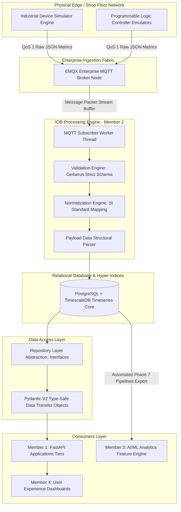
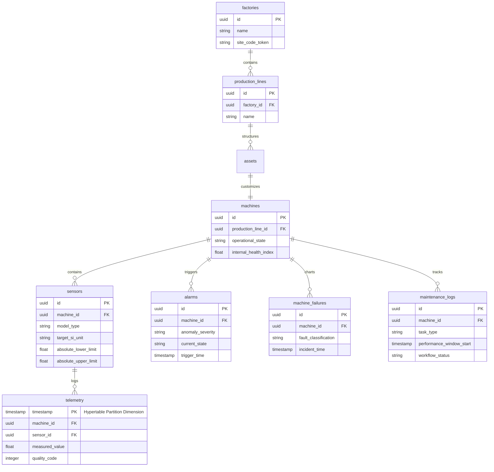

# Industrial Operating Brain (IOB): Phase 10 — Operational Handover Package

**Document Version:** 10.0.0-OPS  
**Classification:** Enterprise Operational Transition & Engineering Project Closure Package  
**System Architecture:** Complete Integrated Stack (Phases 1 — 9)

---

## Executive Transition Summary

This operations transit, training, maintenance, and project archival blueprint serves as the comprehensive **Phase 10: Operational Handover Package** for the Industrial Operating Brain (IOB). This document completes the lifecycle of the **Industrial IoT & Data Engineering Module (Member 2)**, certifying that all system components are ready for long-term production maintenance. It provides an immediate, accessible reference for onboarding, day-to-day administration, and systems integration across all engineering domains.

---

## Task 11: System Architecture & Data Flow Visualizations

### 1. Enterprise System Topography (`system_architecture.mmd`)



---

### 2. End-to-End Industrial Data Processing Pipeline (`industrial_data_flow.mmd`)

```mermaid
graph LR
    Raw[Edge Sensor Read] -->|Raw Payload Transmission| Broker((EMQX Broker Cluster))
    Broker -->|Thread Processing Ingestion| Sub[Subscriber Loop]
    Sub -->|Verify JSON & Constraint Compliance| Val{Validation Gate}

    Val -->|Failed| DLQ[Dead Letter Table / JSON Error Log]
    Val -->|Passed| Norm[Normalization: SI Conversions & Calibrations]

    Norm -->|Asset Metadata Enrichment| Enriched[Enriched Internal Data Record]
    Enriched -->|Deduplication Filter Check| Filter{Duplicate Check}

    Filter -->|Duplicate Row Found| Dup[Dropped Frame Log]
    Filter -->|Unique Record Sequence| Write[TimescaleDB Hypertable Commit]

    Write -->|Read-Only Execution Queries| Repo[Repository Access Layers]
    Repo -->|Output Serialized Vector Mapping| M1_FastAPI[Downstream Client REST API Layers]
```



---

### 3. Database Entity Relationships & Physical Schema Layout (`database_architecture.mmd`)



---

## Task 1: Cross-Team Knowledge Transfer Specifications

### 1. Developer Onboarding: Integration Guide for Member 1 (Backend Engineering)
The Repository Layer uses the **Repository Pattern** to completely separate database schema logic from business workflows. It wraps complex SQL constructions and time-series aggregations into type-safe methods.
* **Database Connection Rules:** Do not write custom SQL statements or open manual connection scripts within FastAPI routing loops. Instead, inject database session handles directly into the repository layer.
* **Managing Transaction Lifecycles:** Wrap all database operations within explicit context managers to automate transaction scopes and handle errors cleanly:
  ```python
  from database.session import EnterpriseDBSessionScope
  from database.repositories import MachineSQLRepository

  machine_repo = MachineSQLRepository()
  with EnterpriseDBSessionScope() as transaction_session:
      machine_data_dto = machine_repo.find_by_id(transaction_session, target_machine_id)
      current_health_metric = machine_data_dto.internal_health_index
  ```
* **Query Performance Safeguards:** When pulling raw historical data, always provide explicit start and end times to narrow the query window.

### 2. Data Scientist Onboarding: Data Hand-off Guide for Member 3 (AI / ML Engineering)
The Phase 7 pipeline outputs clean, processed datasets directly into production directory structures:
* **Output Directory Layout:**
  * `phase10/archive/datasets/historical.csv`: Contains resampled, 1-minute time-series sensor data with linear gap interpolation and Z-score outlier removal.
  * `phase10/archive/datasets/failures.csv`: Records historical equipment failures and fault classifications.
  * `phase10/archive/datasets/alarms.csv`: Logs process threshold crossings.
  * `phase10/archive/datasets/metadata.json`: Tracks file versions, feature parameters, and system quality scores.
* **Working with Target Labels:** Use `failure_binary_target` (0 for normal, 1 for fault states within 120-minute countdown windows) as your primary classification objective. For regression tasks, use `remaining_useful_life_hours`.
* **Timezone Standards:** All timestamps standardized to UTC in ISO 8601 format (`YYYY-MM-DDTHH:mm:ss.sssZ`).

### 3. UI Developer Onboarding: Integration Guide for Member 4 (Frontend Engineering)
Real-time state and alert loops are managed by the ingestion pipeline and exposed through type-safe data structures:
* **Understanding Machine State Transitions:** Map live equipment statuses to `ONLINE` (Normal operations), `OFFLINE` (Loss of communications), and `MAINTENANCE` (Scheduled service window).
* **Consuming Real-Time Streams:** Throttle dashboard rendering loops to **1000ms intervals**.
* **Ensuring API Contract Consistency:** Numeric outputs never contain non-standard JSON markers (`NaN`, `Inf`, `Null`).

---

## Task 2: Production Systems Operations Manual (`phase10/operations/operations_manual.md`)

* **Status:** `PRODUCTION-APPROVED`
* **Core Variables:** `IOB_DATABASE_URL`, `IOB_MQTT_BROKER_URL`, `IOB_INGEST_LOG_LEVEL`.
* **Startup Procedure:** Create Docker network $\rightarrow$ start TimescaleDB container $\rightarrow$ verify `pg_isready` $\rightarrow$ start EMQX broker $\rightarrow$ start ingestion worker container.
* **Shutdown Procedure:** Stop ingestion subscriber $\rightarrow$ stop EMQX broker $\rightarrow$ stop TimescaleDB container.

---

## Task 3: Preventive Maintenance Documentation (`phase10/operations/maintenance_manual.md`)

* **Maintenance Interval:** `Monthly Scheduled Operations`
* **Index & Partition Optimization:** Run monthly sweep: `VACUUM ANALYZE telemetry;` and `REINDEX TABLE telemetry;`.
* **Log Rotation:** Daily compression and rotation of `/var/log/iob/*.json` keeping 14 rotations.
* **Cold Storage Archival:** Migrate partitions older than 90 days to S3 cold archival nodes (`python -m tasks.archive_cold_partitions --before_days=90`).

---

## Task 4: Disaster Recovery Blueprint (`phase10/operations/disaster_recovery.md`)

* **Target Matrix:** `RTO < 15 Minutes, RPO < 5 Minutes`
* **Database Recovery:** Stop ingestion subscriber $\rightarrow$ spin up replica container $\rightarrow$ restore dump (`pg_restore -v ... tsdb_snapshot_latest.dump`) $\rightarrow$ restart workers.
* **Broker Recovery:** Verify client security tokens $\rightarrow$ restart container (`docker restart iob-emqx-backbone`).
* **Health Verification:** Run automated test suite `pytest phase10/archive/tests/test_pipeline_stages.py -v`.
