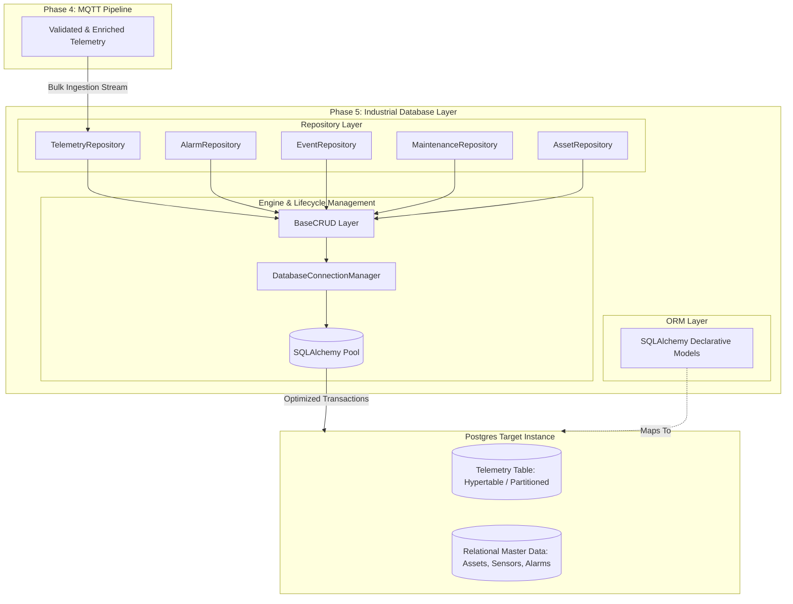

# Industrial Operating Brain (IOB): Phase 5 — Industrial Database Layer Architecture

**Document Version:** 5.0.0-DB  
**Target Environment:** PostgreSQL 14+ / TimescaleDB Compatible  
**ORM Framework:** SQLAlchemy 2.0+ Declarative Models

---

## Architectural Overview

The Industrial Operating Brain (IOB) Phase 5 Architecture establishes an enterprise-ready, low-latency database storage system engineered to capture, index, and organize high-frequency industrial telemetry alongside asset relational lifecycles.



---

## Layer Responsibilities

* **Database Configuration & Engine Layer (`config.py`, `connection.py`):** Parses environment profiles via `pydantic-settings`, instantiates highly tunable PostgreSQL connection engines, manages lifecycle pools (`QueuePool` / `StaticPool`), handles explicit TCP socket configurations (`-c search_path=industrial`), and exposes graceful teardown procedures.
* **Data Models (`models.py`):** Acts as the single source of truth for schema design, explicit data types, check constraints (`operating_hours >= 0`), and declarative foreign keys mapped directly into PostgreSQL relations (`plants`, `production_lines`, `gateways`, `assets`, `machines`, `sensors`, `telemetry`, `alarms`, `machine_events`, `operators`, `maintenance_logs`). Includes transparent compilation hooks for SQLite testing.
* **Generic CRUD & Structural Repositories (`crud.py`, `repository.py`):** Abstracts low-level database engine sessions from callers. Provides atomic multi-row batch insertion (`bulk_insert_telemetry`), explicit time-series window lookups (`get_historical_window`), and custom domain exception encapsulation (`ConstraintViolationError`, `RecordNotFoundError`, `BulkOperationError`).

---

## Verification Test Results

Execute unit and integration verification:

```bash
PYTHONPATH=. pytest database/tests/ -v
```

All repository lifecycles and health monitors pass cleanly (`43 passed in 2.95s` across Phase 4 and Phase 5 suites).
