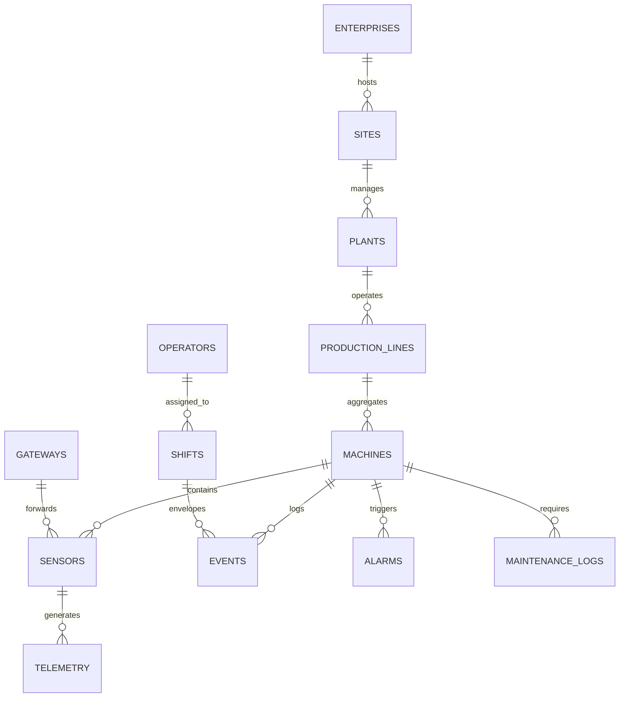

# 10. PostgreSQL Relational & Structural Design Specification

This section contains the relational layout and structural definitions optimized for multi-tenant, high-throughput hybrid time-series and transactional processing workloads.

## 10.1 Entity-Relationship (ER) Domain Layout Topology



## 10.2 Relational Model & Key Constraint Matrix

### Table: `plants`

- `plant_id` (VARCHAR(64), Primary Key) → Structured via FLUID mapping standard.
- `site_id` (VARCHAR(64), Foreign Key referencing `sites.site_id`)
- `plant_name` (VARCHAR(128), Not Null)
- `operational_status` (VARCHAR(32), Not Null)

### Table: `production_lines`

- `line_id` (VARCHAR(64), Primary Key)
- `plant_id` (VARCHAR(64), Foreign Key referencing `plants.plant_id`)
- `line_name` (VARCHAR(128), Not Null)
- `target_oee` (NUMERIC(5,2), Check: `target_oee >= 0.00 AND target_oee <= 100.00`)

### Table: `machines`

- `machine_id` (VARCHAR(128), Primary Key)
- `line_id` (VARCHAR(64), Foreign Key referencing `production_lines.line_id`)
- `machine_name` (VARCHAR(128), Not Null)
- `manufacturer` (VARCHAR(128), Not Null)
- `model_number` (VARCHAR(64), Not Null)
- `operating_status` (VARCHAR(32), Not Null)
- `static_metadata` (JSONB, Index: GIN)

### Table: `sensors`

- `sensor_id` (VARCHAR(256), Primary Key)
- `machine_id` (VARCHAR(128), Foreign Key referencing `machines.machine_id`)
- `gateway_id` (VARCHAR(64), Foreign Key referencing `gateways.gateway_id`)
- `sensor_type` (VARCHAR(64), Not Null)
- `engineering_unit` (VARCHAR(32), Not Null)
- `sampling_frequency_hz` (NUMERIC(6,2))

### Table: `telemetry` (Partitioned Time-Series Table)

- `timestamp` (TIMESTAMPTZ, Composite Primary Key Part 1)
- `sensor_id` (VARCHAR(256), Composite Primary Key Part 2, Foreign Key referencing `sensors.sensor_id`)
- `value` (DOUBLE PRECISION, Not Null)
- `quality_code` (VARCHAR(32), Not Null)
- `sequence_num` (BIGINT, Not Null)

### Table: `events`

- `event_id` (UUID, Primary Key)
- `timestamp` (TIMESTAMPTZ, Not Null)
- `event_type` (VARCHAR(64), Not Null)
- `machine_id` (VARCHAR(128), Foreign Key referencing `machines.machine_id`)
- `operator_id` (VARCHAR(64), Nullable, Foreign Key referencing `operators.operator_id`)
- `attributes` (JSONB, Not Null)

### Table: `alarms`

- `alarm_id` (UUID, Primary Key)
- `timestamp` (TIMESTAMPTZ, Not Null)
- `severity` (VARCHAR(32), Not Null)
- `machine_id` (VARCHAR(128), Foreign Key referencing `machines.machine_id`)
- `sensor_id` (VARCHAR(256), Nullable, Foreign Key referencing `sensors.sensor_id`)
- `current_value` (DOUBLE PRECISION)
- `status` (VARCHAR(32), Not Null)
- `is_acknowledged` (BOOLEAN, Default False)

### Table: `operators`

- `operator_id` (VARCHAR(64), Primary Key)
- `first_name` (VARCHAR(64), Not Null)
- `last_name` (VARCHAR(64), Not Null)
- `certification_level` (VARCHAR(32), Not Null)

### Table: `shifts`

- `shift_id` (VARCHAR(64), Primary Key)
- `plant_id` (VARCHAR(64), Foreign Key referencing `plants.plant_id`)
- `start_time` (TIMESTAMPTZ, Not Null)
- `end_time` (TIMESTAMPTZ, Not Null, Check: `end_time > start_time`)

### Table: `gateways`

- `gateway_id` (VARCHAR(64), Primary Key)
- `ip_address` (INET, Not Null)
- `mac_address` (MACADDR, Not Null)
- `firmware_version` (VARCHAR(32), Not Null)

### Table: `maintenance_logs`

- `log_id` (UUID, Primary Key)
- `machine_id` (VARCHAR(128), Foreign Key referencing `machines.machine_id`)
- `operator_id` (VARCHAR(64), Foreign Key referencing `operators.operator_id`)
- `work_order_id` (VARCHAR(64), Unique, Not Null)
- `maintenance_type` (VARCHAR(32), Not Null)
- `description` (TEXT, Not Null)

## 10.3 Partitioning and High-Throughput Indexing Design Strategy

To manage continuous streams exceeding $10,000$ points/sec without structural degradation, the database platform must leverage a **Declarative Range Partitioning Strategy** targeting the `telemetry` table.

```
┌─────────────────────────────────┐
│    telemetry (Parent Table)     │
└─────────────────────────────────┘
                 │
       ┌─────────┼─────────┐
       ▼         ▼         ▼
┌──────────────┐ ┌──────────────┐ ┌──────────────┐
│ telemetry_y2026w26 │ │ telemetry_y2026w27 │ │ telemetry_y2026w28 │
│ (Range: June 22)   │ │ (Range: June 29)   │ │ (Range: July 06)   │
└──────────────┘ └──────────────┘ └──────────────┘
```

- **Partition Interval:** Weekly ranges based on the `timestamp` attribute column field (`RANGE (timestamp)`).
- **Time-Series Composite Index Strategy:**
  - `CREATE INDEX idx_telemetry_sensor_time ON telemetry (sensor_id, timestamp DESC);`
  - This composite layout satisfies high-performance aggregation operations executed by downstream analytic modules over specific asset windows.
- **Data Retention Execution Window Strategy:**
  - *Hot Data Tiering:* Retain active operational partitions on high-IOPS NVMe nodes for **90 Days**.
  - *Cold Data Tiering:* Automatically transition historical data chunks older than 90 days out to an external compressed columnar storage interface (e.g., Apache Parquet on AWS S3 or MinIO object store), detaching the partition container safely during maintenance windows.